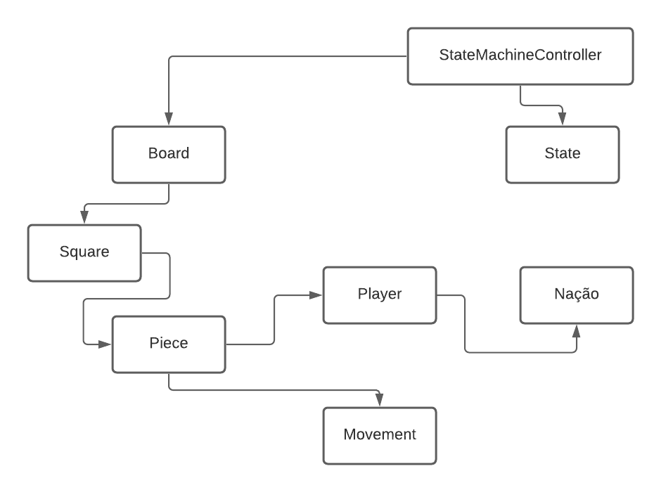

# Projeto *War of Nations*

Trabalho Final da disciplina de MC322 - Programação Orientada a Objetos na UNICAMP, SP.

Para reproduzir o jogo, na pasta [out/production/mc322-trabalho](./out/production/mc322-trabalho), execute a classe java AppChess.

# Descrição

Uma partida de xadrez não é mais apenas uma batalha entre peças brancas e peças pretas, agora é uma batalha entre nações.  

Cada nação tem habilidades especiais que mudam drasticamente o fluxo da partida: você não precisa se preocupar com o próximo movimento de uma peça se ela estiver congelada!

## Fluxo do Jogo

O jogo tem como base uma partida de xadrez entre duas nações, entretanto cada nação possui habilidades especiais que alteram um pouco a lógica do jogo original. Ganha o jogo quem der Xeque-Mate no oponente. 

### Pontuação

Cada peça comida por um jogador possui um valor que será somado à sua pontuação, sendo:

* Peão: 1 ponto
* Cavalo: 3 pontos
* Bispo: 3 pontos
* Torre: 5 pontos
* Rainha: 9 pontos

### Habilidades

Cada nação terá uma *Habilidade Básica* e uma *Habilidade Principal*, que podem ser usadas durante a partida. Cada habilidade possui um custo que deve ser descontado da pontuação do jogador para que seja utilizada. A *Habilidade Básica* custa 3 pontos e a *Habilidade Especial* custa 9 pontos.

## Nações

### Nação de Gelo

* *Habilidade Básica:* Congela a casa selecionada. As peças sobre casas congeladas não podem se mover. Dura 1 turno.
* *Habilidade Especial:* Congela a casa selecionada e as suas casas imediatamente vizinhas.

### Nação de Pedra

* *Habilidade Básica:* Levanta uma muralha de pedra na casa selecionada. Nenhuma peça, exceto pelo cavalo, pode realizar um movimento que passe por uma casa que possua uma muralha de pedra. Peças que estão em casas que possuem uma muralha podem sair. O efeito dura 1 turno.
* *Habilidade Especial:* Selecionando uma Casa, levantam-se muralhas de pedra nas suas casas vizinhas.

# Equipe

* Igor Henrique Buranello dos Santos - RA 171953
* Wallace Gustavo Santos Lima - RA 195512

# Vídeos do Projeto
## 
## 

# Slides do Projeto
## 
## 

# Relatório de Evolução

> Começamos por desenvolver a base do jogo de Xadrez e a Interface Gráfica. Por não termos compreendido adequadamente à época como seria um projeto feitos em componentes de software, esta parte foi feita somente com Classes e as relações entre elas. Com o básico de Xadrez desenvolvido, nos restava algumas análises de movimentos e checagens especiais caracteristicas do Xadrez (como o Roque, a captura *en passant* e as análises de Xeque e Xeque-Mate) e a criação da Máquina de Efeitos. Durante o processo da criação da Máquina de Efeitos, com a ideia de componentes mais madura, pudemos desenvolve-la com bases nos princípios de componentização. Por fim, juntamos os componentes e tentamos adaptar o restante do projeto de acordo com esses princípios. 

# Destaques de Código

> Utilizamos instâncias estáticas das componentes para acessar seus métodos globalmente.

~~~java
public static StateMachineController instance;

public static Window instance

public static IEffects instance
~~~
> No projeto, o Controller (parte da arquitetura) édividido em 2 componentes : Umcomponente composto por uma máquina de estados, chamadaStateMachineController,juntamente com as classes dos estados do jogo e demovimento das peças, e outrocomponente  formado pelo EffectMachineController e as classes relacionadas aos efeitos.
> Os estados do jogo são o seguinte:
* LoadState: Estado que carrega as peças no tabuleiro
* TurnBeginState: Estado que inicia o turno e determinao jogado atual do turno
* PieceSelectionState: Estado para o usuário selecionaruma peça
* MoveSelectionState: Estado para o usuário escolher1 dentre os possíveismovimentos para aquela peça.
* BasicSkillSelectionState: Estado para escolher umaregião do tabuleiro para aplicarum poder básico.
* MainSkillSelectionState: Estado para escolher umaregião do tabuleiro para aplicarum poder especial.
* PieceMovementState: Estado que realiza um determinadomovimento da peça.
* TurnEndState: Estado que analisa o fim do turno,podendo acabar ou não o jogo.
* GameEndState: Estado que avisa o término do jogo,e encerra seu fluxo
> O fluxo do jogo (a execução ordenada destes estadoscitados a cima) é controladopela StateMachineController, através do método:
~~~java
// Muda o jogo do estado atual para um outro estado. Antes de iniciar o novo estado, executa a saída do estado anterior.
public void changeTo(State state) {
    if (this.currentState != state) {

        if (this.currentState != null) {
            this.currentState.exit();
        }

        this.currentState = state;
        if (this.currentState != null) {
            this.currentState.enter();
        }
    }
}
~~~
> Passando uma instancia de um estado (os estados são classes abstratas, quepossuem duas métodos : public void enter() e publicvoid exit(), que são executados quandoo estado é iniciado e finalizado, respectivamente.A método changeTo sempre, ao iniciar umnovo estado, executa o método exit() do estado anteriorantes de executar o método enter() do novo estado.
> A StateMachineController controla o fluxo iniciandoum novo estado sempre quechega no fim de um estado atual: No final do TurnBeginState,inicial o estado dePieceSelectionState. Neste estado nada acontece atéque o jogador clique em uma peça, ea máquina de estados inicie o estado de MoveSelectionState,em que nada acontece atéque o jogador clique em alguma das posições disponíveispara aquela peça se movimentar.Seguindo este fluxo, a StateMachineController, atravésde sucessivas chamadas do métodochangeTo, mantém o fluxo do jogo. Quando chega noTurnEndState, ou retorna para umachamada de TurnBeginState, reiniciando um ciclo, ou chama o GameEndState, encerrendoo fluxo do jogo.
> EX:
~~~java
public class PieceMovementState extends State{   // Movimenta a peça e inicia o estado de fim de turno.

    public void enter(){
        System.out.println("PieceMovementState:");

        Square highlightedSquare = Board.instance.getSquare(StateMachineController.instance.getSelectedHighlight()[0], StateMachineController.instance.getSelectedHighlight()[1]);
        MoveType moveType = highlightedSquare.getMoveType();

        // Analisa qual será o tipo de movimento e executa o movimento necessário.
        if (moveType == MoveType.CastlingMovement)
            SpecialsMovements.castlingMovement();
        
        else if (moveType == MoveType.PawnPromotionMovement)
            SpecialsMovements.pawnPromotion();
        
        else if (moveType == MoveType.PawnDoubleMovement)
            SpecialsMovements.pawnDoubleMovement();
        
        else if (moveType == MoveType.EnPassantMovement && StateMachineController.instance.getSelectedPiece() instanceof Pawn)
            SpecialsMovements.enPassantMovement();
        
        else
            SpecialsMovements.normalMovement();

        // Volta o MoveType do square selecionado para NormalMovement
        highlightedSquare.setMoveType(MoveType.NormalMovement);

        // Após 1 rodada, transforma os moveType EnPassantMovement do inimigo em NormalMovement.
        int iPos = (StateMachineController.instance.getCurrentPlayer().getTeam() == "WhiteTeam") ? 2 : 5;
        clearEnemyEnPassants(iPos);
        
        StateMachineController.instance.changeTo(new TurnEndState());
    }
~~~
> Neste estado PieceMovementState, uma ferramenta éutilizada para saber qual tipode movimento fazer (pois no xadrez existem movimentosespeciais): Public enum.
~~~java
public enum MoveType {     // Após obter os movimentos válidos para uma dada peça com as classes que herdam Movement, todos os squares
                           // desses movimentos tem seu atributo moveType atualizado para NormalMovement. Após isso, caso haja algum
    CastlingMovement,      // movimento especial para algum desses squares, o atributo moveType é alterado para este movimento especial.

    PawnPromotionMovement,

    PawnDoubleMovement,

    EnPassantMovement,

    NormalMovement;
}
~~~
> Este public enum MoveType foi criado como forma deenumerar as possíveis formasde movimento e atribuí-los a um quadrado do tabuleiro.Todos os quadrados inicialmentepossuem um NormalMovement como valor de seu MoveType.No PieceSelectionState,percebe-se que, ao clicar em um quadrado no MoveSelectionStatepara mover a peça paraele, o tipo de movimento executado é o que se encontrana variável MoveType daquelequadrado. Esta variável MoveType de um quadrado éalterada caso haja algum movimentoespecial ao mover uma peça para aquele quadrado.
> O movimento de todas as peças herdam Movement, classeque possui o metodoGetValidMoves, que reccebe dois parâmetros : A peçaque sera movida, e uma variávelbooleana que indica se é para ser analisado ou nãomovimentos seguros. Movimentoseguro entende-se um movimento que que, ao mover,não coloque o Rei em xeque.
~~~java
// Retorna uma lista com as posições de todos os movimentos possíveis para uma dada peça. O parametro safeMovements, caso tenha o valor
// true, faz com que o método retorne apenas os movimentos que evitem que o Rei do jogador fique em cheque.
public abstract ArrayList<int[]> getValidMoves(boolean safeMovements, Piece piece);
~~~
> O método isSquareAttacked analisa se um determinadoquadrado está sendoatacado por um jogador passado como parâmetro.
~~~java
// Analisa se um dado square está sob ataque de alguma peça do jogador passado como argumento
public static boolean isSquareAttacked(Player player, Square square)
~~~
> O conjunto de métodos, getSafeMovements e isSafeMovement,analisam, para cadamovimento possível de uma peça obtido pelo getValidMoves(caso a parâmetrosafeMovements tenha sido passada como true), se aomover esta peça para aquelaposição, o Rei continua seguro.
# Conclusões e Trabalhos Futuros

> Concluímos uma primeira versão, para entrega, do projeto com uma componentização ainda tímida, pois demoramos a assimilar o conceito de componentes de software. Com o conceito mais maduro e trabalhado, pretendemos componentizar os três componentes principais, isto é, desenvolvê-los de modo que sejam conntituidos de componentes externos. Isso seria especialmente bem-vindo no componente Chess.
> Nesse sentido, pretendemos abandonar a instanciação estática e fazer a conexão entre os componentes de maneira direta.
> Por fim, após essas melhorias estruturais, pretendemos expandir o projeto: criar mais nações e poderes especiais.

# Documentação dos Componentes

## Diagrama Geral do Projeto
  

* **View** deve fazer a ponte entre os usuários e o jogo em si. Ela recebe comandos (por meio de cliques com o *mouse*) e os comunica para a **Máquina de Estados**.    
* A **Máquina de Estados** é a responsável pela orquestração máxima do jogo: ela recebe da **Interface Gráfica** os comandos do usuário, administra os estados de jogo e informa as configurações dos demais componentes durante o jogo.    
* A **Máquina de Efeitos** recebe informações de uso de habilidades pelos jogadores, as configura e retorna informações sobre os efeitos que estão ativadas no momento. 

## Componente EffectsManagement
> Componente que gere os efeitos do jogo: congelamento e muralha de pedras. Com ele podemos atribuir efeitos e fazer consultas sobre efeitos ativos.

**Ficha Técnica**
item | detalhamento
----- | -----
Classe | `effect.EffectMachineControl`
Autores | `Wallace Gustavo Santos Lima`
Interfaces | `IManageEffects`   `IAskEffects`

## Componente View
> Componente responsável pela apresentação gráfica do jogo. Recebe informações do usuário e se as comunica para a máquina de efeitos.

**Ficha Técnica**
item | detalhamento
----- | -----
Classe | `view.Window`
Autores | `Wallace Gustavo Santos Lima`   `Igor Henrique Buranello dos Santos`
Interfaces | `IManageRepresentation`

## Componente Chess
> Componente principal do jogo. A partir dele podemos fazer perguntas sobre o estado do jogo e pedir movimentações.

**Ficha Técnica**
item | detalhamento
----- | -----
Classe | `chess.StateMachineControl`
Autores | `Wallace Gustavo Santos Lima`   `Igor Henrique Buranello dos Santos`
Interfaces | `IAskChess`   `IOperateChess`   `IChess`

**Detalhamento**

O componente Chess é o mais complexo dos componentes do projeto, ele funciona com um sistema interno bastante complexo.

Ele funciona com base nos estados de jogo, classes **State** (*Carregamento, Início de Jogo, Início de turno, Seleção de Peça, Seleção de Habilidade, Seleção de Destino, Execução de Movimento, Fim de Turno e Fim de jogo*). Cada estado corresponde a uma etapa do jogo de xadrez que deve agir de uma maneira diferente.

Classes do Componente:

* O **Board** modela a plataforma de Xadrez e faz a comunicação com as **Squares**.
* Cada **Square** modela uma casa da plataforma de xadrez e faz a ligação com a **Piece** que está sobre ela.  
* **Piece** modela as peças do jogo de xadrez e possui instâncias de **Movement**, os quais fornecem informações sobre a movimentação das peças.
* **Player** representa um dos usuários do Jogo e contém informações relevantes como a Pontuação, a Nação ao qual ele pertence e e acesso as Habilidades que podem ser usadas.
* **Nation** representa as nações do jogo. Cada nação possui uma habilidade básica e uma habilidade principal que podem ser executadas.

## Detalhamento das Interfaces

### Interface `IManageEffects`

`Interface que permite informa mudanças de efeitos para a Máquina de Efeitos`

~~~
public interface IManageEffects {

    public boolean freezeSquare(int iPos, int jPos);

    public boolean createWall(int iPos, int jPos);

    public void passShift();
}
~~~

Método | Objetivo
-------| --------
`freezeSquare` | `Solicita o congelamento de um Square`
`createWall` | `Solicita a criação de uma muralha na posição informada`
`passShift` | `Informa uma mudança de turno`

### Interface `IAskEffects`

`Interface que permite perguntas para a Máquina de Efeitos`

~~~
public interface IAskEffects
{
    public boolean isFrozen(int iPos, int jPos);

    public boolean isWall(int iPos, int jPos);

    public String getEffectName(int iPos, int jPos);
}
~~~

Método | Objetivo
-------| --------
`isFrozen` | `Pergunta se um Square está congelado`
`isWall` | `Pergunta se há uma muralha em um Square`
`getEffectName` | `Pergunta o nome do efeito que está ativo sobre um Square`

### Interface `IManageRepresentation`

`Interface que permite o gerenciamento da representação gráfica do jogo.`

~~~
public interface IManageRepresentation 
{
    public void actualizeSquareRepresentation(int iPos, int jPos, boolean attPiece);
}
~~~

Método | Objetivo
-------| --------
`actualizeRepresentation` | `Solicita a atualização da representação de um Square.`
