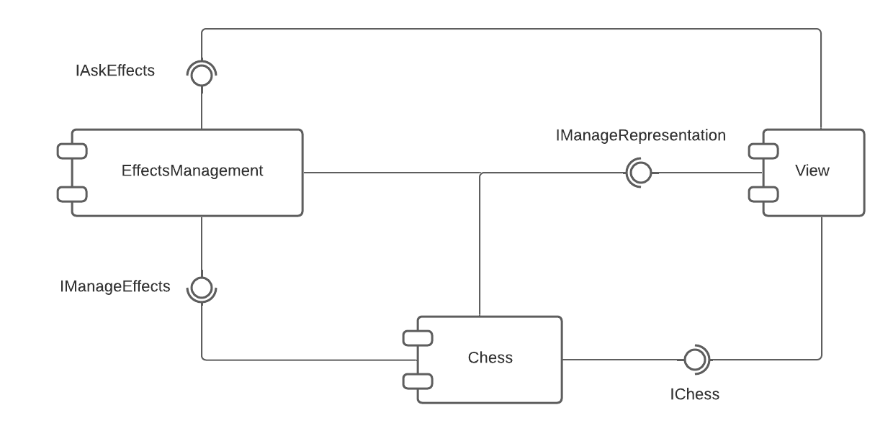

# Projeto *War of Nations*

Trabalho Final da disciplina de MC322 - Programação Orientada a Objetos na UNICAMP, SP.

## Descrição

Uma partida de xadrez não é mais apenas uma batalha entre peças brancas e peças pretas, agora é uma batalha entre nações.  

Cada nação tem habilidades especiais que mudam drasticamente o fluxo da partida: você não precisa se preocupar com o próximo movimento de uma peça se ela estiver congelada!

### Fluxo do Jogo

O jogo tem como base uma partida de xadrez entre duas nações, entretanto cada nação possui habilidades especiais que alteram um pouco a lógica do jogo original. Ganha o jogo quem der Xeque-Mate no oponente. 

#### Pontuação

Cada peça comida por um jogador possui um valor que será somado à sua pontuação, sendo:

* Peão: 1 ponto
* Cavalo: 3 pontos
* Bispo: 3 pontos
* Torre: 5 pontos
* Rainha: 9 pontos

#### Habilidades

Cada nação terá uma *Habilidade Básica* e uma *Habilidade Principal*, que podem ser usadas durante a partida. Cada habilidade possui um custo que deve ser descontado da pontuação do jogador para que seja utilizada. A *Habilidade Básica* custa 5 pontos e a *Habilidade Especial* custa 12 pontos.

### Nações

#### Nação de Gelo

* *Habilidade Básica:* Congela a casa selecionada. As peças sobre casas congeladas não podem se mover. Dura 1 turno.
* *Habilidade Especial:* Congela a casa selecionada e as suas casas imediatamente vizinhas.

#### Nação de Pedra

* *Habilidade Básica:* Levanta uma muralha de pedra na casa selecionada. Nenhuma peça, exceto pelo cavalo, pode realizar um movimento que passe por uma casa que possua uma muralha de pedra. Peças que estão em casas que possuem uma muralha podem sair. O efeito dura 1 turno.
* *Habilidade Especial:* Selecionando uma Casa, levantam-se muralhas de pedra nas suas casas vizinhas.

## Equipe

* Igor Henrique Buranello dos Santos - RA 171953
* Wallace Gustavo Santos Lima - RA 195512

## Vídeos do Projeto
### 

## Slides do Projeto
### 

## Documentação dos Componentes

## Diagramas

### Diagrama Geral do Projeto
  
* A **Interface Gráfica** deve fazer a ponte entre os usuários e o jogo em si. Ela recebe comandos (por meio de cliques com o *mouse*) e os comunica para a **Máquina de Estados**.    
* A **Máquina de Estados** é a responsável pela orquestração máxima do jogo: ela recebe da **Interface Gráfica** os comandos do usuário, administra os estados de jogo (*Carregamento, Início de Jogo, Início de turno, Seleção de Peça, Seleção de Habilidade, Seleção de Destino, Execução de Movimento, Fim de Turno e Fim de jogo*) e informa as configurações dos demais componentes durante o jogo.    
* A **Máquina de Efeitos** recebe informações de uso de habilidades pelos jogadores e as configura no **Tabuleiro** e retorna informações sobre as habilidades que estão ativadas no momento.      
* O **Jogador** representa um dos usuários do Jogo e contém informações relevantes como a Pontuação, a Nação ao qual ele pertence e as Habilidades que podem ser usadas.    
* O **Tabuleiro** modela a plataforma de Xadrez e faz a comunicação com as **Casas**.    
* Cada **Casa** modela uma casa da plataforma de xadrez e possui informações como a **Peça** que está sobre ela e o **Efeito** ao qual ela está submetida.  
* A **Peça** modela as peças do jogo de xadrez e possui instâncias de **Movimento**, o qual controla os movimentos das peças.    
* Por fim, **Efeito** é um modelo dos efeitos de habilidades do jogo.

### Componente Effects
> Componente que gere os efeitos do jogo: congelamento e muralha de pedras. Com ele podemos atribuir efeitos e fazer consultas sobre efeitos ativos.

**Ficha Técnica**
item | detalhamento
----- | -----
Classe | `effect.EffectMachineControl`
Autores | `Wallace Gustavo Santos Lima`
Interfaces | `IManageEffects`   `IAskEffects`

### Interfaces

Interface agregadora do componente em Java:

~~~java
public interface IDataSet extends ITableProducer, IDataSetProperties {
}
~~~
